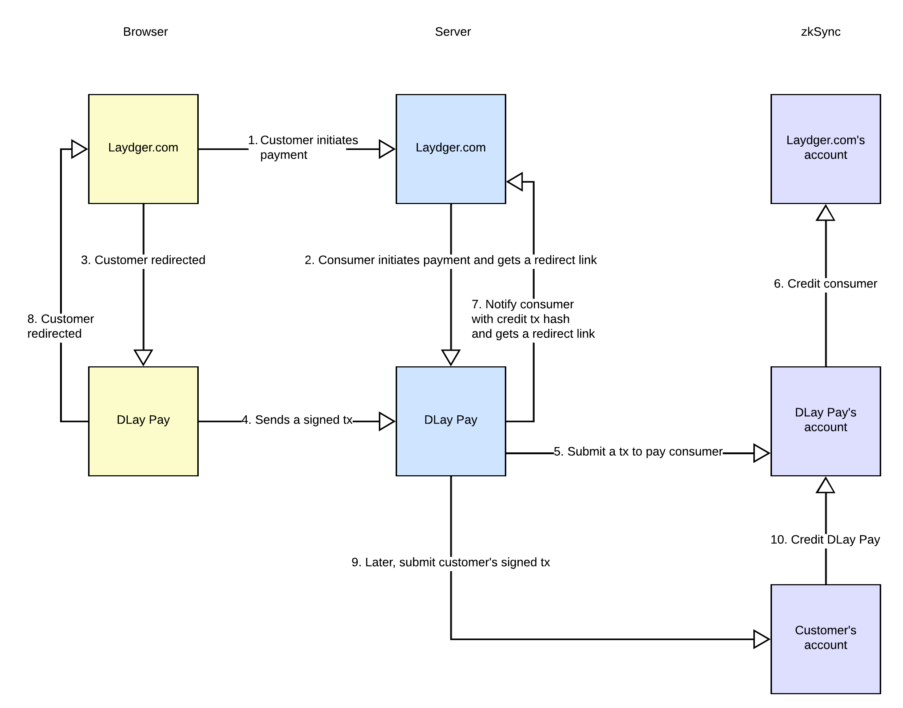
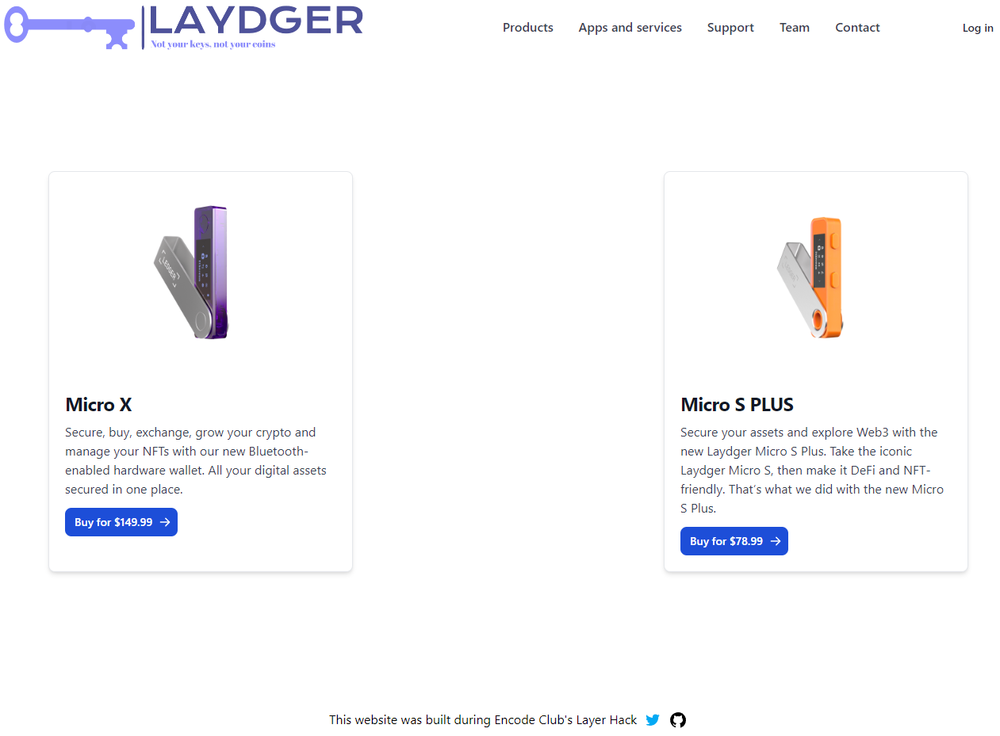
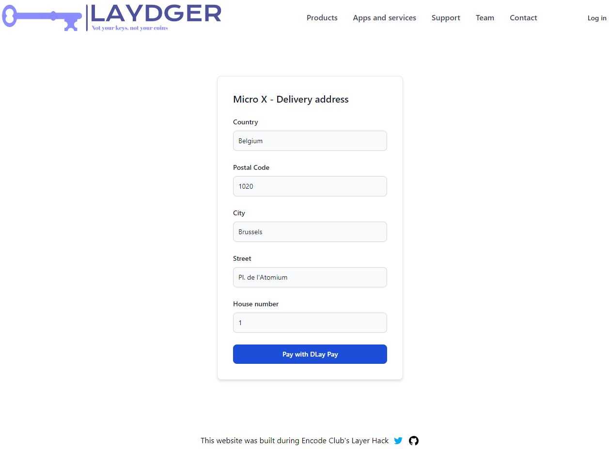
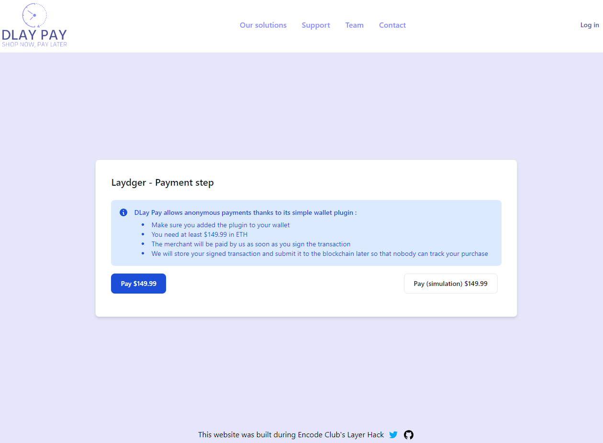
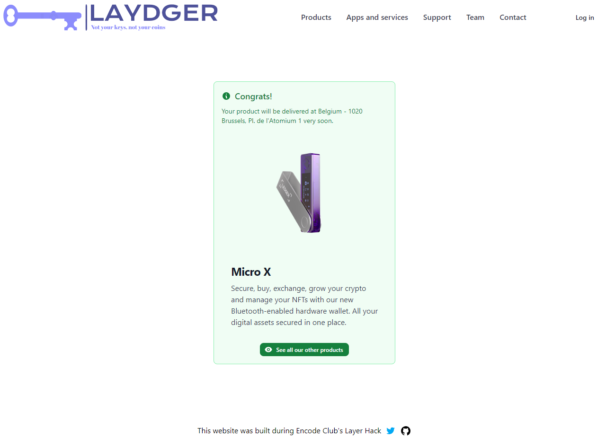

# DLay Pay server

### Summary
DLay Pay is a service allowing online stores (= consumers) to offer anonymous payments.
[Laydger.store](https://laydger.store) is a consumer built for demo purpose.
DLay Pay asks the customer to sign the purchase transaction but don't immediately submit it to zkSync's network.
Besides, the `to` field is set to DLay Pay's address.

It stores the signed transaction and signs then submits a similar transaction but this time with the consumer's address as `to` field.

This way, sensitives information (name, email, delivery address, etc.) aren't linked to the customer main address.

### Other repositories created during the hackathon
- [dlay-pay-client](https://github.com/ootsun/dlay-pay-client)
- [laydger-client](https://github.com/ootsun/laydger-client)
- [laydger-server](https://github.com/ootsun/laydger-server)

### Description
The whole process can be described in 10 steps :

1. The customer initiates a payment on the consumer's website
2. Its server contacts DLay Pay's server with this information : paymentId, merchantId, amountInWei, callbackUrl and addressToCredit. The response contains a redirect link pointing to DLay Pay's website.
3. The consumer redirects the customer
4. He connects his wallet and sign a transaction. The transaction's recipient is DLay Pay's address
The signed transaction isn't submitted to zkSync. Instead, it's sent to DLay Pay's server
5. The server signs and submits a similar transaction with the consumer's address as recipient
6. The consumer's account gets credited
7. The server notifies the consumer's server with the transaction hash. The consumer's server verify that the transaction is valid then responds with a redirect url pointing to its own website.
8. The customer is redirected and his payment is successful!
9. Later, DLay Pay's server submits the customer's signed transaction to zkSync.
10. DLay Pay's account gets credited

#### Advantages :
- In case of malicious actions or hacks, neither the consumer nor DLay Pay is able to link the customer's sensitives information (name, email, delivery address, etc.) to his main wallet address
- The consumer can delegate the most dangerous part of the payment's process (the private key management) to an external service and store his private key in cold a cold wallet
- DLay Pay take care of zKSync fee market's volatility

#### Drawback :
- DLay Pay charges a fee
- The consumer misses the opportunity to analyze his customer's wallet. Privacy is preserved.

#### Areas for improvement
- The customer could spend all his funds before DLay Pay submits the signed transaction. To avoid that, a wallet plugin would be built.
The plugin would act as a 2 of 2 multisig between the customer and DLay Pay. By default, DLay Pay approves all transaction.
But if DLay Pay detects that the customer is moving funds that are required for his purchase, the transaction wouldn't be approved.
If DLay Pay goes rogue and censors the customer, a 1-hour count down could start. Once the delay passed, the plugin would be uninstalled.
But this way, DLay Pay can always detect an uninstallation and submit a possible transaction.
- DLay Pay could use a Pay Master to allow the customer to pay in any token of his choice
- Lots of security checks still need to be implemented
- Using Sismo Protocol, the customer could mint a ZK badge on his public wallet address attesting that he is the one that made the payment. A use case for this badge would be : allow customers to shop without email/password authentication.
- DLay Pay could send the money minus a random difference (between 0.1 and 1%) to further obfuscate the transaction

### Screenshots
#### Steps 1, 2 and 3

#### Steps 4, 5, 6, 7 and 8

#### Successful payment

### Hosted at
[dlay-pay.xyz](https://dlay-pay.xyz)

### Author
This project was developed by [OoTsun](https://twitter.com/Oo_Tsun).
